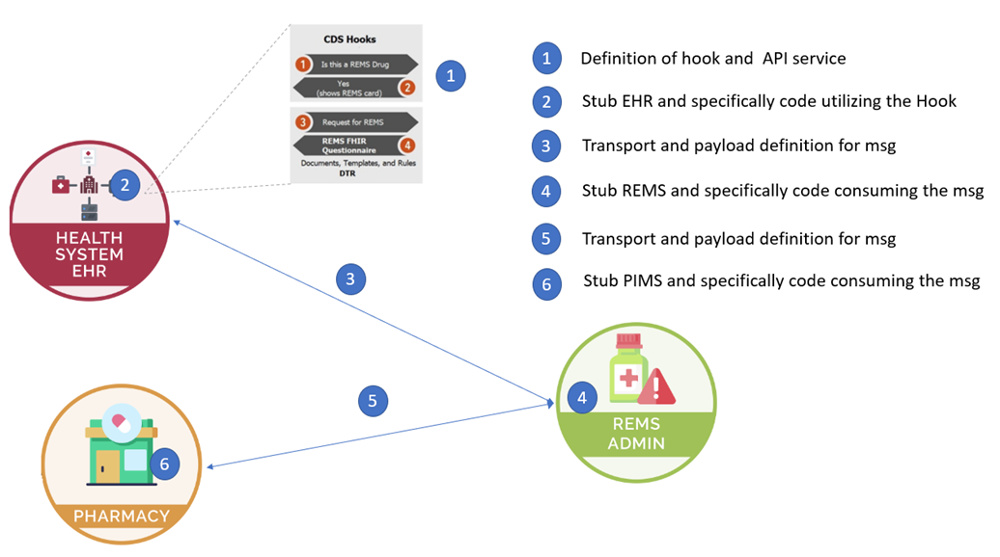

# Prototype Repositories and Capabilities

## (As of April 24, 2023. Prototype version 0.9)

(Note: $${\color{blue}Blue}$$ numbers correspond to the numbers in the diagram above)

(Note: Numbers correspond to the numbers in the diagram above)

### Repositories

- mcode/REMS
    * REMS Administrator (4)
        + Node/TypeScript
        + (1.1)(3) CDS Hooks (server) end points
        + (1.4) FHIR Server to support DTR
            + Contains Questionnaire, Library (w/ CQL), ValueSets
            + Retrieves and caches ValueSets from VSAC
        + (5) Interface to check status of REMS
        +   Stores data in MongoDB
    * Docker scripts to launch the entire stack
    * Stores data in MongoDB

- mcode/test-ehr
    * Test EHR (2)
        + Java HAPI FHIR Server
        + Contains test patient data
        + Supports launching DTR SMART on FHIR app

- mcode/crd-request-generator
    * Request Generator (2)
        + Node/JavaScript
        + Web Application mimicking the EHR frontend
        + Requests
            + (1.1)(3) Generates CDS Hooks order-sign (client) that is sent to the REMS Admin
            + (1.2)(3) Handles CARDS returned from REMS Admin to launch DTR
            + Sends Rx to PIMS using NCPDP Script NewRx

- mcode/dtr
    * DTR Server
        + Node/JavaScript
        + (1.3) SMART on FHIR application
        + (1.4) Retrieves Questionnaires and other resources from REMS Admin
        + Runs CQL to prepopulate Questionnaire with data from the Test EHR
        + Sends completed Questionnaires to REMS Admin
        + Saves partially completed Questionnaires to Test EHR
        + After submitting completed form to REMS Admin, displays page showing ETASU and Pharmacy status

- mcode/pims
    * Pharmacy Information System (6)
        + Node/TypeScript
        + Receives Rx from Request Generator
        + (5) Provides interface to monitor status of REMS
        + Allows pharmacist to mark Rx as dispensed
        + Provides interface for querying status of Rx
            + Non-standard, created for demo purposes only
    * Stores data in MongoDB

- mcode/rems-smart-on-fhir
    * REMS SMART on FHIR Application
        + SMART on FHIR application to generate CDS Hooks interaction with REMS Admin for any EHR that does not support CDS Hooks
            + Node/TypeScript

- mcode/rems-cds-hooks
    * Git submodule used by REMS SMART on FHIR Application and REMS Admin
        + TypeScript
        + Prefetch implementation
        + Type definitions for CDS Hooks needed by TypeScript

### Other Components

- KeyCloak
    * Authentication of users
    * Docker config hosted in mcode/test-ehr

- MongoDB
    * Stores data for REMS Admin and PIMS in separate databases
    * Docker config hosted and stored in mcode/REMS
